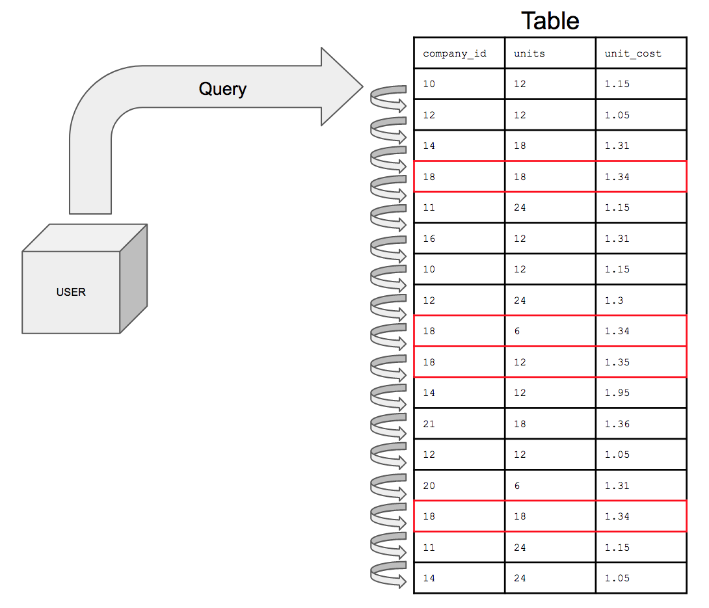
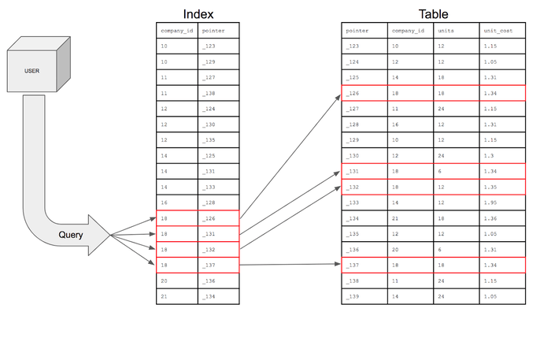

## How indexes work? 
Indexes typically use a B-tree or B+ tree structure, which keeps data sorted and balanced. When a query searches using an indexed column, the database navigates the tree to narrow down results quickly, much like using the index of a book to find pages on a specific topic instead of reading every page.

` "When the index creates a data structure on a specific column it is important to note that no other column is stored in the data structure"`

### without indexing

### with indexing
