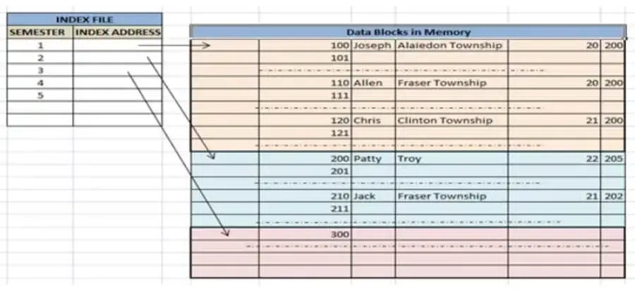
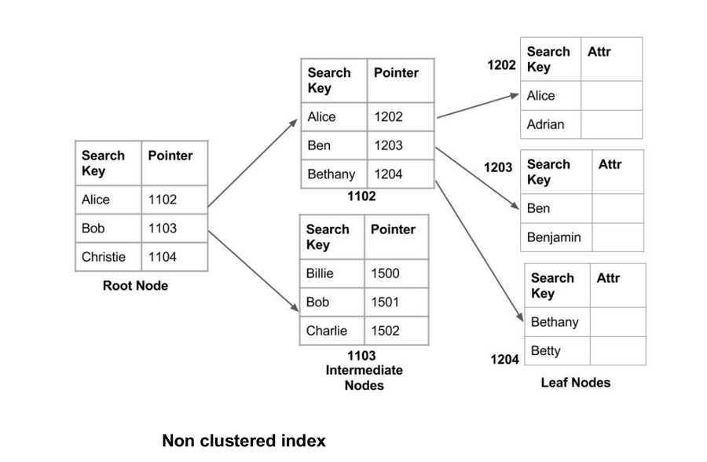

# Types of Indexes

### Clustered Index
A clustered index `sorts and stores the actual table data rows physically on disk according to the index key`. There can be only one per table because the data rows themselves are sorted this way. This improves range queries and joins that use the indexed column. Primary keys often have clustered indexes.​

### Non-clustered Index
Non-clustered indexes are `separate from the data storage itself`. They `store only the indexed column values and pointers` to the corresponding rows. A table can have multiple non-clustered indexes. These are like the book’s table of contents giving pointers to where the data is stored.​

A non-clustered index just tells us where the data lies, i.e. it gives us a list of virtual pointers or references to the location where the data is actually stored. Data is not physically stored in the order of the index. Instead, data is present in leaf nodes.

### Primary Index
A special form of clustered index using the table’s primary key. Since primary keys are unique, the index order is sequential, enabling efficient data retrieval.​

### Composite Index
Indexes involving multiple columns. The order of columns in the index is crucial; `the index works best when queries filter or sort using the leftmost columns`. Useful for composite key lookups and multi-column filters.​

### Unique Index
Ensures all values in the indexed column(s) are unique, supporting constraints like primary keys and unique keys.​

### Covering Index
This index stores all the columns required by a query, allowing the database engine to fulfill the query from the index alone, avoiding the need to access the full table data and improving performance.​

### Partial/Filtered Index
An index built only on a subset of rows defined by a filter condition. Useful when certain rows are queried frequently, reducing index size and maintenance overhead while optimizing relevant queries.​

### Full-Text Index
Specialized indexes for fast text searches within large text columns. They provide capabilities beyond traditional indexes for words and phrases searching.​

#### differen

| Index Type | Best Use Case                 | Strengths                                  | Weaknesses                                     |
| ---------- | ----------------------------- | ------------------------------------------ | ---------------------------------------------- |
| Hash       | Exact equality search (=)     | Very fast for exact matches, small index   | No range query, less widely supported          |
| GIN        | Full-text, JSON, array search | Fast multi-element queries, complex data   | Large index size, slower updates               |
| GiST       | Multidimensional/spatial data | Flexible, supports range & spatial queries | Possible false positives, slower exact matches |

https://www.geeksforgeeks.org/dbms/indexing-in-databases-set-1/